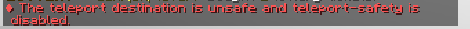

<h1 style="text-align: center;">Welcome to The Cavern Wiki</h1>

 

Welcome to The Cavern! A truly unique 1.20.2 survival towny server, designed to give players endless enjoyment by introducing a modpack like adventure without ever installing a modpack. 

The Cavern is a minecraft server that allows **Java** and **Bedrock** players to play on a server with tons of plugins that gives you a unique experience. We provide an SMP-like gameplay in an economy driven server. We use [Towny](https://github.com/TownyAdvanced/Towny/wiki) as our claiming system and The Cavern have many plugins that will capture ur attention.

### Table of contents
- [Server Basics](#server-basics)
  - [Server Site](#server-site)
  - [World](#world)
  - [Basic Commands](#basic-commands)
  - [Server Ranks](#server-ranks)
  - [Voting](#voting)
  - [Crates](#crates)
- [References](#references)

## Server Basics
### Server Site
Our minecraft server have a website that you can go to do serveral stuff like do. This website have all kinds of things related to our server, providing you with serveral services like:

- [**Forums**](https://thecavern.net/forums/): Engage with fellow players, share tips and tricks, discuss updates, and connect with the community through our forums. Whether you're seeking advice, looking for new friends to play with, or just want to hang out, our forums are the place to be.

- [**Staff Application**](https://thecavern.net/forums/): Interested in joining our team as a moderator or administrator? Submit your staff application through our website and showcase your passion for the server. You can find this on the bottom of the page in our Forums after you logged in.

- [**Ban Appeals**](https://thecavern.net/forums/): If you've been banned and believe it was unjust or wish to appeal your ban, our website provides a convenient platform to submit your appeal. Our staff will review your case and ensure fair treatment for all players.

- [**Donations**](https://store.thecavern.net/): Support the server and unlock exclusive perks and rewards by making a donation. Your contributions help us maintain and improve the server for everyone to enjoy. You can get vanity item such as 3D Wings or Season Crate Keys which will give you vanity items that have a 3D sprite that you can see with our server texture pack.

- [**Server Rule**](https://thecavern.net/rules/): Get all the details you need about our server rules.

- [**Vote Links**](https://thecavern.net/pages/vote/): Help us grow and reach new players by voting for our server on various Minecraft server listing websites. Every vote counts and helps us attract more players to our community and will give you a vote key which you can use to open a vote crates to get stuff like hoppers.

 

  </img>

Image 1.1 Cavern forums landing page

  </img>
  
Image 1.2 Cavern forums landing page after login

### World
Our server have three types of worls, which is:
- **Main World**, There is only one instance of this type of world which is the mainworld and its only have overworld dimension, this is where you want to build bases because the world itself wont reset and most slimefun stuff are enabled in this world.
- **Resource World**, In this type of world, the world will reset every month regularly. Usually the reset will be anounced in our discord server and there will be a serverwide event killing the ender dragon. There is 3 types of resource which is Overworld resource, Nether resource, and End resource.
- **Server World**, This type of world are managed by the server and cant be modified by the player.

### Basic Commands
There are many ways to 
1. **Navigation Commands**
  
To navigate the server easily, we profide serveral commands that aids you to navigate throughout the server worlds and location.

  - Home Commands
  
    In this server you can set up ur a private teleportation where only you can teleport to called homes. Each player can set a finite amount of homes and that player rank determines the amount of homes they can set.

    |Command|Uses|
    |-|-|
    |`/sethome <homename>`|Set a home in player standing position|
    |`/home <homename>`|Teleports to a home|
    |`/delhome <homename>`|Deletes a home|
    |`/homes`|List all of the homes you have|
    
    A player can set up a home using the command `/sethome <homename>`. After a player set a home they can teleport to that home location by typing `/home <homename>`. When a player want to change the home location, they can do the same command as setting up the home with the same homename `/sethome <homename>`. And if the player wish to remove their home they can remove it using `/delhome homename`. `/homes` can be used if you want to get the list of homes that you have set.

    Teleporting to a home requires the player to stand still for 3 seconds before they were teleported. When a home is obfuscated, it will teleport you to the nearest safe area to teleport

    When creating a home, the server checks if you are on a save area or not. A location considered "Safe" when you stand on it, it doesnt dammage the player, the block in the player head is a hollow block, and it is inside the world border<a href="https://github.com/EssentialsX/Essentials/blob/71ca7ffbf6c36c9fd18cf61056295dca4a733f62/Essentials/src/main/java/com/earth2me/essentials/utils/LocationUtil.java#L146">[1]</a>. A location is considered dammaging if the block below is a block that can dammage a player<a href="https://github.com/EssentialsX/Essentials/blob/71ca7ffbf6c36c9fd18cf61056295dca4a733f62/Essentials/src/main/java/com/earth2me/essentials/utils/LocationUtil.java#L164">[2]</a>. Hollow blocks is all material that is [transparent](https://minecraft.wiki/w/Opacity#Types_of_transparent_blocks) except barrier and solid blocks(Path and Farmland), and [Light Block](https://minecraft.wiki/w/Light_Block)<a href="https://github.com/EssentialsX/Essentials/blob/71ca7ffbf6c36c9fd18cf61056295dca4a733f62/Essentials/src/main/java/com/earth2me/essentials/utils/LocationUtil.java#L42">[3]</a>.

     
    

      </img>
      
Image 1.4 Sethome command success

    

    

      </img>
      
Image 1.5 Sethome command not safe

    

    

      </img>
      
Image 1.6 Sethome command limit reached

    

    
  - Player Warp

    Player Warp is a way for players to set a warp location that can also be accessed by other players. Players can use it to do serveral things like set up a shop, show their builds, create a gathering area, and many more.

    |Command|Uses|
    |-|-|
    |`/pw help`|Displaya help menu|
    |`/pw <warp>`|Teleports to the player warp|
    |`/pw set <warp>`|Sets a warp in player locaotion|
    |`/pw remove <warp>`|Remove a player warp|
    |`/pw desc set <warp> <desc>`|Set a player warp description|
    |`/pw desc remove <warp>`|Remove a player warp description|
    |`/pw list`|List all player warp|
    |`/pw ban set <warp> <player>`|Bans a player from player warp|
    |`/pw ban remove <warp> <player>`|Unbans a player from player warp|
    |`/pw ban list <warp>`|List all banned player in a player warp|
    |`/pw open [category]`|Open player warp gui|
    |`/pw amount`|Check how much player warp slot you have|
    |`/pw lock <warp>`|Locks a player warp|
    |`/pw reset <warp>`|Move a player warp location|
    |`/pw rename <warp> <name>`|Renames a player warp|
    |`/pw category set <warp>`|Set a player warp category|
    |`/pw password set <warp>`|Set a player warp password|
    |`/pw password remove <warp> <password>`| Remove a player warp password|

    The amount of player warp you can have per player depends on your rank. The amount of player warp per rank can be seen in the [ranks](#ranks) section.

    When you want to move a player warp or wants to discontinue it, it is highly suggested that u do not remove the player warp, but re-set it instead or lock it. When you remove a player warp, every info about it like total visits and reviews will be reset, which mean you will lost all of that when u remove it.

    When opening the player warp gui menu(without specifying a category), you will be asked to choose a category to open, click one of the category to see the list of player warp in that category. A player warp can be categorized into 5 category, which is `build`, `farm`, `other`, `pvp`, and `shop`.

     
    

      </img>
      
Image 1.7 Player warp menu

    

    Once you entered the player warp list in the gui, there are serveral buttons that lets you navigate the gui. Here's some explaination for the buttons

    - **Search Button (Sign)**, Lets you search a player warp by its name
    - **Sort (Hopper)**, Select how the gui sorts the player warps
    - **View your warps (Ender Pearl)**, View the player warps that you set

   

  - Server Warp
    
    Server Warp can be accessed using the commmand `/warp` or `/warp <warpname>`. Here are some of the server warps:

    - **Town**, A town that have a lot of MoFood shops
    - **Crates**, A place where you can use your keys to open crates
    - **End**, The end dimension resource world main island
    - **Leaderboards**, This is where the you can see the leaderboard for Total Fish Caught, Most Money, Top Playtime, and Most Votes.
    - **Dungeon**, The place that lets you enter the dungeon with the dungeon key
    - **Pinata**, A place where vote party is held

     
    

      </img>
      
Image 1.8 Server warp menu

    

  - Player Teleportation

### Server Ranks
In this server there is two types of rank that you can get, in-game ranks and store rank. In-game ranks can be obtained by buying them in `/ranks`, or u can also rankup into your next rank using `/rankup`. 

|Rank|Upgrade Price|Total Price|
|-|-|-|
|Citizen|10,000|10,000|
|Merchant|45,000|55,000|
|Clerk|65,000|120,000|
|Novice|90,000|210,000|
|Apprentice|110,000|320,000|
|Squire|140,000|460,000|
   
The second type of ranks is the store ranks. Store ranks is a bit diffrent from in-game ranks because it actually cant be bought using in-game currency(althought you can pay another person to donate for you, see the [IRL Trading](#irl-trading) section). The things that also makes store ranks different from in-game ranks is that store ranks will overwrite the ingame rank, meaning you dont have to be a certain rain to obtain a stora ranks. When you bought a store rank, your in-game rank will be the same but the store rank will overwrite every perks your in-game rank have. This means if you for example transfer your donator rank in your bedrock into your java account, your bedrock account will be back using your ingame rank. You can also rankup ur ingame rank using `/ranks` and `/rankup` even tho u already have a store rank.

|Store|Upgrade Price|Total Price|
|-|-|-|
|Viscount|10.00 USD|10.00 USD|
|Duke|15.00 USD|25.00 USD|
|King|25.00 USD|50.00 USD|

Each of the store rank have also a female-equivalent title in each store rank. you can use the command `/<ranktitle>` to change ur rank title into the desired title. Here are the list of title and their counterpart.

|Male|Female|
|-|-|
|viscount|viscountes|
|duke|duchess|
|king|queen|

Each rank can give you many perks. Here are some of those perks that you can get for each rank:

|Perk|Newcomer|Citizen|Merchant|Clerk|Novice|Apprentice|Squire|Viscount|Duke|King|
|---------------| -| -| -| -| -| -| -| -| -| -|
|Lottery Tickets| 1| 2| 2| 2| 2| 2| 2| 3| 4| 5|
|Job            | 1| 1| 1| 2| 2| 2| 2| 3| 4| 6|
|Pet Storage    | -| -| -| -| 2| 2| 2| 3| 5|10|
|Chest Shops    | -| -|12|12|12|14|18|45|50|60|
|Auction Listing| -| -| 2| 2| 3| 3| 5| 8|15|20|
|Player Warp    | -| -| -| -| -| -| 1| 1| 2| 3|
|Sethome        | 1| 2| 2| 3| 3| 3| 3| 5|10|20|
|`/art`         |✘|✔|✔|✔|✔|✔|✔|✔|✔|✔|
|`/marry`       |✘|✔|✔|✔|✔|✔|✔|✔|✔|✔|
|`/crawl`       |✘|✘|✘|✔|✔|✔|✔|✔|✔|✔|
|`/lay`         |✘|✘|✘|✔|✔|✔|✔|✔|✔|✔|
|`/mypet`       |✘|✘|✘|✘|✔|✔|✔|✔|✔|✔|
|`/enderchat`   |✘|✘|✘|✘|✘|✔|✔|✔|✔|✔|
|`/nation`      |✘|✘|✘|✘|✘|✘|✔|✔|✔|✔|
|`/hat`         |✘|✘|✘|✘|✘|✘|✔|✔|✔|✔|
|`/itemfilter`  |✘|✘|✘|✘|✘|✘|✘|✔|✔|✔|
|`/eglow`       |✘|✘|✘|✘|✘|✘|✘|✔|✔|✔|
|`<item>`       |✘|✘|✘|✘|✘|✘|✘|✔|✔|✔|
|`/autoswap`    |✘|✘|✘|✘|✘|✘|✘|✔|✔|✔|
|`/near`        |✘|✘|✘|✘|✘|✘|✘|✘|✔|✔|
|`/getpos`      |✘|✘|✘|✘|✘|✘|✘|✘|✔|✔|
|`/ptime`       |✘|✘|✘|✘|✘|✘|✘|✘|✔|✔|
|`/nick`        |✘|✘|✘|✘|✘|✘|✘|✘|✔|✔|
|`/efly`        |✘|✘|✘|✘|✘|✘|✘|✘|✔|✔|
|`/back`        |✘|✘|✘|✘|✘|✘|✘|✘|✘|✔|
|`/craft`       |✘|✘|✘|✘|✘|✘|✘|✘|✘|✔|
|`/recipe`      |✘|✘|✘|✘|✘|✘|✘|✘|✘|✔|
|`/top`         |✘|✘|✘|✘|✘|✘|✘|✘|✘|✔|
|`/condense`    |✘|✘|✘|✘|✘|✘|✘|✘|✘|✔|
|`/trash`       |✘|✘|✘|✘|✘|✘|✘|✘|✘|✔|
|`/sell all`    |✘|✘|✘|✘|✘|✘|✘|✘|✘|✔|

### Voting

If you want to support our server, consider vote for our server in minecraft voting websites. Voting will also gives you Vote Keys that lets you open a Vote Crate. If you want to get a list of sites that lets you vote for our server, either

- Get them from our website [https://thecavern.net/pages/vote/](https://thecavern.net/pages/vote/)
- Get them in our discord server in [#welcome](https://discordapp.com/channels/702144279807656038/702153358315749406/729469286174949423) channel

### Crates

In this server there are serveral crates that can give you many things such ask hopper, shulker shells, and more. To visit our crate area, you can use the command `/warp` and click the crate, or do `/warp crate`. 

To open a crate, you will need that crate's key to open it. Each crate key can be obtained through diffrent means. Some of them are able to be obtained ingame, and some are obtained exclusively through the server store. There are a total of 4 crates you can open in this server.

## References
1. [isBlockUnsafeForUser method in EssentialX Github](https://github.com/EssentialsX/Essentials/blob/71ca7ffbf6c36c9fd18cf61056295dca4a733f62/Essentials/src/main/java/com/earth2me/essentials/utils/LocationUtil.java#L146)
2. [isBlockDamaging method in EssentialX Github](https://github.com/EssentialsX/Essentials/blob/71ca7ffbf6c36c9fd18cf61056295dca4a733f62/Essentials/src/main/java/com/earth2me/essentials/utils/LocationUtil.java#L164)
3. [HOLLOW_MATERIALS field in EssentialX Github](https://github.com/EssentialsX/Essentials/blob/71ca7ffbf6c36c9fd18cf61056295dca4a733f62/Essentials/src/main/java/com/earth2me/essentials/utils/LocationUtil.java#L42)
